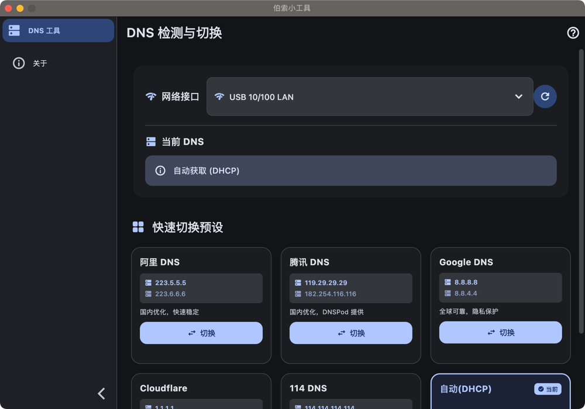

# 伯索小工具

> 跨平台桌面小工具集，支持 Windows 和 macOS（x86/ARM）。

[English](./README_EN.md)

---

## 下载

前往 [Releases](https://github.com/liangzhaoliang95/plasoSmallTool/releases) 页面下载最新版本：

| 平台 | 文件 |
|------|------|
| macOS (arm64 / x86_64) | `plasoSmallTool_macos_arm64.dmg` |
| Windows x64 | `plasoSmallTool_setup.exe` |

## 截图



## 功能

### DNS 工具
- 检测当前系统 DNS 配置
- 一键切换常用公共 DNS（阿里、腾讯、Google、Cloudflare、114）
- 恢复自动获取（DHCP）
- 支持多网络接口管理

## 技术栈

| 库 | 用途 |
|----|------|
| Flutter 3.x | 跨平台 UI 框架 |
| flutter_riverpod | 状态管理 |
| go_router | 路由 |
| sidebarx | 侧边栏导航 |
| window_manager | 窗口管理 |
| url_launcher | 打开外部链接 |

## 权限说明

### macOS
- 已关闭 App Sandbox，可调用系统命令
- 修改 DNS 时会弹出系统授权对话框（需要管理员密码）
- 无法上架 Mac App Store，仅支持直接分发

### Windows
- 需要以管理员身份运行
- 启动时会触发 UAC 提示

## 开发

### 前置要求

- Flutter 3.x
- **macOS**：需要 Xcode，运行 `sudo xcode-select --switch /Applications/Xcode.app/Contents/Developer`
- **macOS**：需要 CocoaPods，运行 `sudo gem install cocoapods`

### 运行

```bash
# macOS
flutter run -d macos

# Windows
flutter run -d windows
```

### 构建

```bash
# macOS Universal Binary (arm64 + x86_64)
flutter build macos --release

# Windows
flutter build windows --release
```

### 验证 macOS Universal Binary

```bash
lipo -info build/macos/Build/Products/Release/plasoSmallTool.app/Contents/MacOS/plasoSmallTool
# 期望输出: Architectures in the fat file: arm64 x86_64
```

## 项目结构

```
lib/
├── core/
│   ├── constants/        # 应用常量和 DNS 预设
│   └── theme/            # Material 3 主题
├── features/
│   ├── dns/
│   │   ├── data/         # DNS 服务抽象层和平台实现
│   │   ├── models/       # 数据模型
│   │   ├── providers/    # Riverpod providers
│   │   └── ui/           # UI 组件
│   └── about/
│       └── ui/           # 关于页面
└── shared/
    ├── layout/           # 应用布局（侧边栏）
    └── widgets/          # 共享组件
```

## 添加新功能

1. 在 `lib/features/` 下创建新功能目录
2. 在 `lib/shared/layout/app_shell.dart` 中添加侧边栏条目
3. 在 `lib/app.dart` 中添加路由

## License

[MIT](./LICENSE)
